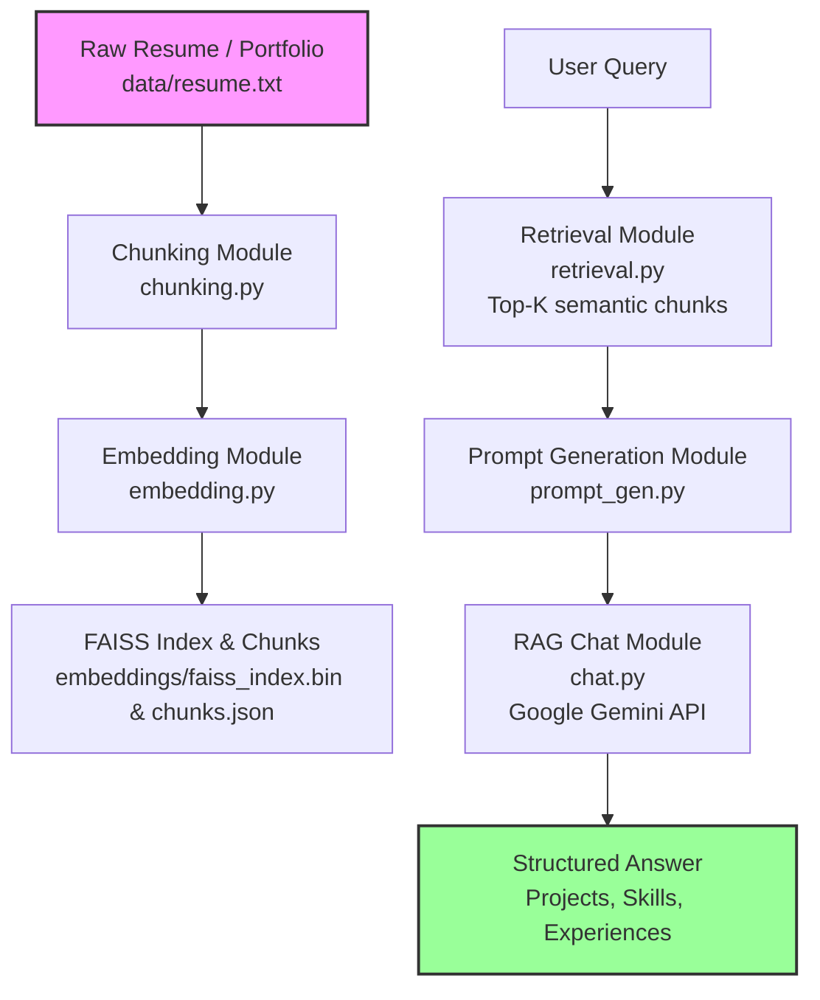
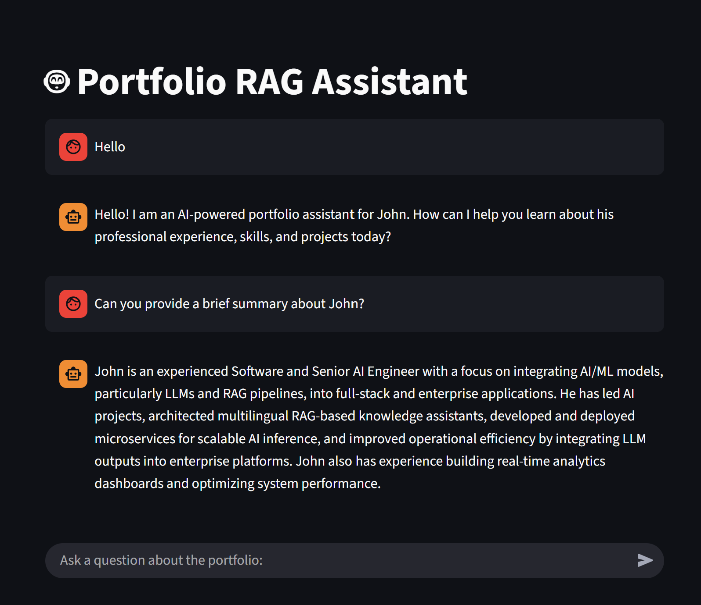

# 🧠 AI Portfolio RAG Assistant

A **Retrieval-Augmented Generation (RAG)** application for querying a structured professional portfolio or resume using natural language.
Powered by **Sentence Transformers**, **FAISS**, and **Google Gemini**, it retrieves relevant resume chunks and generates structured, factual answers.

[](https://ragaiportfolio-jomddiifktjgguvo57tah8.streamlit.app/)


---

## 📑 Table of Contents

1. [Live Demo](#-live-demo)
2. [Key Features](#-key-features)
3. [Project Structure](#-project-structure)
4. [Quick Start](#-quick-start)

   1. [Clone Repository](#1-clone-repository)
   2. [Create Virtual Environment](#2-create-virtual-environment-and-install-dependencies)
   3. [Configure Environment Variables](#3-configure-environment-variables)
   4. [Define Your Resume](#4-define-your-resume-under-data-folder)
   5. [Generate Embeddings](#5-generate-embeddings)
   6. [Launch the App](#6-launch-the-app)
5. [RAG Pipeline & Modules](#-rag-pipeline--modules)
6. [Evaluation](#-evaluation)
7. [Potential Enhancements](#-potential-enhancements)
8. [Screenshots / Demo](#-screenshots--demo)
9. [Contact](#-contact)

---

## 🌐 Live Demo

Try the AI Portfolio RAG Assistant instantly via this link:

[Click here to test the live app](https://ragaiportfolio-jomddiifktjgguvo57tah8.streamlit.app/)

> ✅ Includes a sample portfolio (John) for immediate testing.

---

## ⚡ Key Features

* Semantic retrieval of resume/portfolio chunks.
* Structured summarization of projects, experiences, and skills.
* Highlights projects and skills in responses.
* Interactive chat interface via Streamlit.
* Preloaded sample resume for fast testing.

---

## 📁 Project Structure

```plaintext
ai_portfolio_rag/
├── data/                  # Raw resume text files
│   └── john.txt         # Example resume (John)
├── embeddings/ 
│   ├── faiss_index.bin    # FAISS index for example resume
│   └── chunks.json        # Precomputed chunks for example resume
├── src/ 
│   ├── app.py             # Streamlit frontend 
│   ├── chat.py            # Chat interface & model integration
│   ├── chunking.py        # Resume chunking logic
│   ├── config.py          # Environment variables & constants
│   ├── embedding.py       # Embedding generation + FAISS index builder
│   ├── prompt_gen.py      # Prompt generator for Gemini
│   ├── retrieval.py       # Retrieve relevant chunks via FAISS
│   └── evaluate.py        # Evaluate retrieval and generation
├── requirements.txt       # Python dependencies
├── .env                   # API keys and configuration
└── README.md
```

---

## 🚀 Quick Start
In case you want to try it on your own resume/portfolio:

### 1. Clone repository

```bash
git clone https://github.com/Aymen-Besbes/ai_portfolio_rag.git
cd ai_portfolio_rag
```

### 2. Create virtual environment and install dependencies

```bash
python -m venv venv
source venv/bin/activate     # Linux/Mac
venv\Scripts\activate        # Windows

pip install -r requirements.txt
```

### 3. Configure Environment Variables

Create a `.env` file in the project root:

```env
GEMINI_API_KEY=<YOUR_GEMINI_API_KEY>
EMBEDDING_MODEL=sentence-transformers/all-MiniLM-L6-v2
MODEL=gemini-2.5-flash
INDEX_PATH=embeddings/faiss_index.bin
CHUNKS_PATH=embeddings/chunks.json
RESUME_PATH=data/resume.txt
CHUNK_SIZE=150
CHUNK_OVERLAP=30
TOP_K=10
```

> ✅ **Note:** A sample resume for "John" is already included with its FAISS index and chunks.


---

### 4. Define your resume under data folder

```bash

# Summary
[Short professional summary]

# Professional Experiences
## Job Title — Company (Start – End)
* Objective:
[role description]
* Responsibilities & Achievements:
- Bullet points with measurable results
* Technologies / Skills:
[Skills & tools]

# Projects
## Project 1: Project Name (Month Year)
* Objective:
[project objective]
* Key Features:
- Feature 1
- Feature 2
* Responsibilities / Role:
- Tasks performed
* Results / Achievements:
- Metrics/outcomes
* Technologies / Skills Used:
[Skills]
* Current Status:
[Completed / Active / Prototype]

```

### 5. Generate embeddings

```bash
python src/embedding.py
```

### 6. Launch the app

```bash
streamlit run src/app.py
```

---

## 🔄 RAG Pipeline & Modules



### Pipeline Components

1. **Chunking (`chunking.py`)**

   * Parses Markdown resume into semantic chunks (Summary, Experiences, Projects, Languages).
   * Preserves context and section relationships using a buffer.

2. **Embeddings (`embedding.py`)**

   * Generates embeddings using **Sentence Transformers**.
   * Builds a FAISS index for efficient similarity search.

3. **Retrieval (`retrieval.py`)**

   * Lazy-loads FAISS index and chunk data.
   * Retrieves top-k relevant chunks based on query embeddings.

4. **Prompt Generation (`prompt_gen.py`)**

   * Creates structured prompts for **Google Gemini**.
   * Ensures projects, achievements, and skills are clearly included.

5. **RAG Chat (`chat.py`)**

   * Combines retrieval and prompt generation.
   * Sends prompt to Gemini API and returns context-aware responses.

6. **Web App (`app.py`)**

   * Streamlit frontend for interactive queries.

---

## 📊 Evaluation
This evaluation used the resume of a fresh graduate AI Engineer to test an AI system’s performance on retrieval and generation tasks. A total of 20 queries were submitted to assess how effectively the system identified and described the engineer’s projects.

The system demonstrated near-optimal performance. It retrieved almost all relevant project data and generated answers fully consistent with the supporting context:

| Metric                | Description                                                     |   Score  |
| :-------------------- | :-------------------------------------------------------------- | :------: |
| **Projects Recall**   | Fraction of expected projects correctly retrieved               | **0.95** |
| **Faithfulness**      | Degree to which responses were grounded in retrieved data       | **1.00** |
| **Context Precision** | Fraction of retrieved chunks accurately referenced in responses | **1.00** |

---

## ⚡ Potential Enhancements

* Multi-format resume support (PDF, DOCX, HTML).
* Combine semantic and keyword-based retrieval with re-ranking.
* Multi-user support and session histories.
* Expand to multiple resumes or portfolios.

---
## 📷 Screenshots / Demo

## 📬 Contact

**Author:** Aymen Besbes
**Email:** [aymen.besbes@outlook.com](mailto:aymen.besbes@outlook.com) | [aymen.besbes@ensi-uma.tn](mailto:aymen.besbes@ensi-uma.tn)
**LinkedIn:** [https://www.linkedin.com/in/aymen-besbes](https://www.linkedin.com/in/aymen-besbes)


