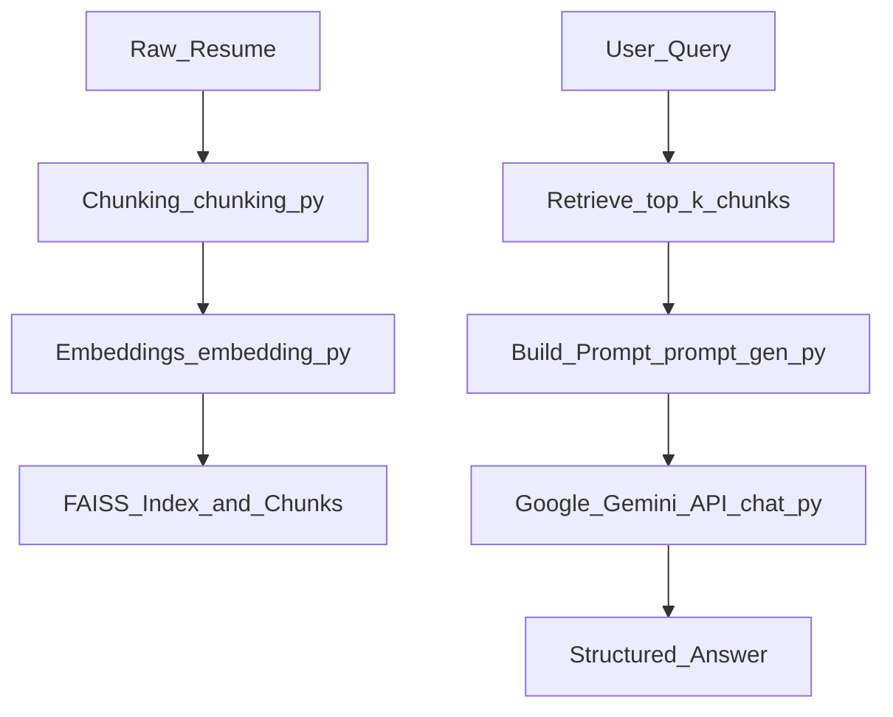

# 🧠 AI Portfolio RAG Assistant

A **Retrieval-Augmented Generation (RAG)** application for querying a structured professional portfolio or resume using natural language.  
Powered by **Sentence Transformers**, **FAISS**, and **Google Gemini**, it retrieves relevant resume chunks and generates structured, factual answers.

---
## Key Features
- Semantic retrieval of resume/portfolio chunks.
- Summarization and structured responses.
- Project and skill highlighting.
- Interactive chat interface via Streamlit.

---
## 📁 Project Structure
```plaintext
ai_portfolio_rag/
├── data/ # Raw resume text file
│ └── resume.txt
├── embeddings/ 
│ ├── faiss_index.bin
│ └── chunks.json
├── src/ 
│ ├── app.py # Streamlit frontend
│ ├── chat.py # Chat interface & model integration
│ ├── chunking.py # Resume chunking logic
│ ├── config.py # Environment variables & constants
│ ├── embedding.py # Embedding generation + FAISS index builder
│ ├── prompt_gen.py # Prompt generator for Gemini
│ ├── retrieval.py # Retrieve relevant chunks via FAISS
│ └── Evaluate.py # Evaluate Retrieval and generation
├── requirements.txt # Python dependencies
├── .env # API keys and configuration
└── README.md
```

---

## ⚙️ Setup

### 1. Clone repository
```bash
git clone https://github.com/Aymen-Besbes/ai_portfolio_rag.git
cd ai_portfolio_rag
```
### 2. Create Virtual environment
```bash
python -m venv venv
source venv/bin/activate     # Linux/Mac
venv\Scripts\activate        # Windows
```

### 3. Install dependencies
```bash
pip install -r requirements.txt
```

### 4. Configure environment variable
Create .env in project's root:
```bash
GEMINI_API_KEY=your_gemini_api_key
EMBEDDING_MODEL=your_embedding_model
MODEL=your_model
INDEX_PATH=embeddings/faiss_index.bin
CHUNKS_PATH=embeddings/chunks.json
RESUME_PATH=data/your_resume_file
CHUNK_SIZE=chunk_size
CHUNK_OVERLAP=chunk_overlap
TOP_K=top_k_chunks
```
### 5. Add your projects and experiences document
Place a strucured txt - Markdown document under data folder using this structute template (you can add  other sections):

```bash
# Summary
[Short professional summary]

# Professional Experiences
## Job Title — Company (Start – End)
### Objective:
[role description]
### Responsibilities & Achievements:
- Bullet points with measurable results
### Technologies / Skills:
[Skills & tools]

# Projects
## Project 1: Project Name (Month Year)
### Objective:
[project objective]
### Key Features:
- Feature 1
- Feature 2
### Responsibilities / Role:
- Tasks performed
### Results / Achievements:
- Metrics/outcomes
### Technologies / Skills Used:
[Skills]
### Current Status:
[Completed / Active / Prototype]
```

---

## 🔄 RAG Pipeline 

### Flowchart


### Explanation
## RAG Pipeline Components

### 1. Chunking (`chunking.py`)
- Parses Markdown resume into semantic chunks: Summary, Professional Experiences, Projects, Languages.
- Handles subheadings, bullet points, and preserves context.
- Uses regex to identify roles, objectives, responsibilities, and projects.

**Strategy:** Section-based + sub-section buffer  
**Reasoning:** Keeps related content together; improves retrieval accuracy.

---

### 2. Embeddings (`embedding.py`)
- Encodes chunks using **Sentence Transformers**.
- Default model: `all-MiniLM-L6-v2` (384 dimensions, float32).
- Generates FAISS index for efficient similarity search.

**Reasoning:** Efficient, semantic embeddings; small memory footprint; suitable for short/medium text like resumes.

---

### 3. Retrieval (`retrieval.py`)
- Lazy-loads FAISS index and chunk data.
- Computes query embeddings and retrieves top-k chunks via L2 distance.
- Ensures context completeness, merges duplicates, resolves pronouns.

**Reasoning:** FAISS top-k search is fast, easy to implement, and sufficient for small datasets.

---

### 4. Prompt Generation (`prompt_gen.py`)
- Constructs structured prompts for **Google Gemini**.
- Includes context chunks, system instructions, and user query.
- Formats projects, achievements, and skills clearly.

**Reasoning:** Structured prompts reduce hallucinations and produce consistent, factual answers.

---

### 5. RAG Chat (`chat.py`)
- Combines retrieval and prompt generation.
- Sends prompt to Gemini API.
- Returns structured, context-aware responses.

### 6. Web App (`app.py`):
- Streamlit frontend.
- Displays structured answers with context.

---

## Launch the app:
```bash
streamlit run src/app.py
```

--- 

## RAG System Evaluation:

We tested the QA system with key queries to check how well it retrieves and generates answers about Aymen’s projects. The metrics used:

* **Projects Recall** ✅ – How many expected projects were correctly detected.
* **Faithfulness** 🎯 – Whether the generated projects are grounded in retrieved data (no hallucinations).
* **Context Precision** 📌 – Fraction of retrieved chunks actually referenced in the answer.

**Example Results**

| Query                      | Projects Recall | Faithfulness | Context Precision |
| -------------------------- | --------------- | ------------ | ----------------- |
| Healthcare Projects        | 1.0             | 1.0          | 1.0               |
| Machine Learning Projects  | 0.75            | 1.0          | 1.0               |
| Dashboards / Visualization | 1.0             | 1.0          | 1.0               |

This evaluation ensures answers are **accurate, relevant, and grounded** in the portfolio data.

---
## ⚡ Potential Enhancements

* Multi-format Resume Support:
    - Allow PDF, DOCX, and HTML input in addition to Markdown.
    - Automatically extract text and structure it into chunks.
* Advanced Retrieval & Re-ranking:
    - Combine semantic embeddings with keyword-based search.
    - Re-rank retrieved chunks for higher relevance and accuracy.
* Add multi-user support with personalized session histories.
* Expand retrieval to include multiple resumes or portfolios.
* Streaming LLM responses for faster interaction

---

## 📬 Contact
Author: Aymen Besbes Email: Aymen.besbes@outlook.com | Aymen.besbes@ensi-uma.tn

LinkedIn: https://www.linkedin.com/in/aymen-besbes

